# Dukani

**Curated volumes & fine footwear** - A premium Django e-commerce
experience built on [Oscar](https://github.com/django-oscar/django-oscar).
Dukani features a luxury retail storefront, sophisticated catalogue
management, an intuitive basket system, and a multi-step checkout
pipeline.

---

## Experience the Storefront

### 1. Brand Experience
The luxury retail landing page, featuring seamless navigation and editorial merchandising.
- 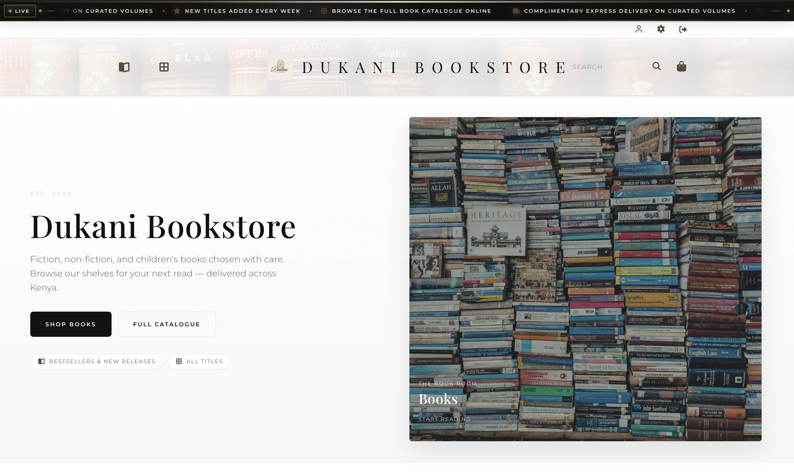

### 2. Curated Catalogue
Browse-optimized grids for books, fashion, and artisanal footwear.
- 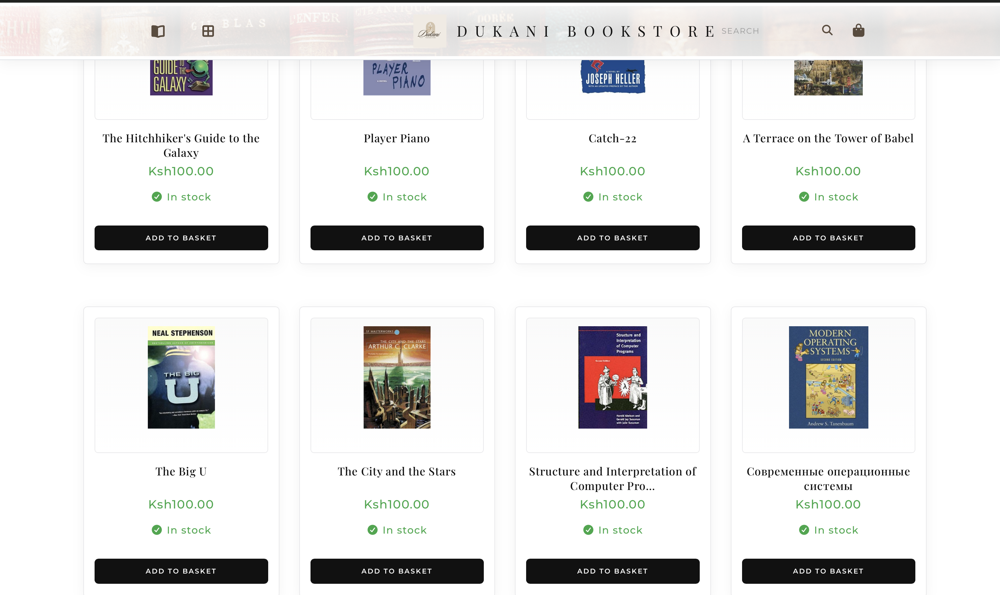

### 3. Shopping Bag
A modern, card-based bag for managing selections before checkout.
- 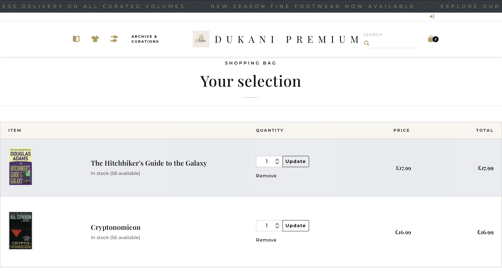

### 4. Shipping & Logistics
Frictionless multi-step checkout pipeline starting with secure address entry.
- 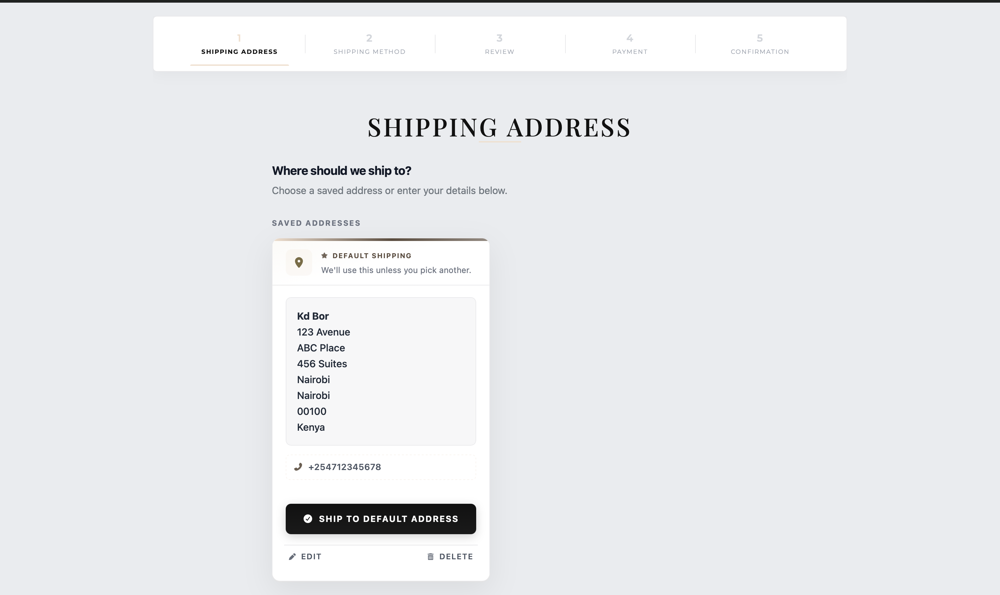

### 5. Secure Payment
Integrated payment processing with clear cost breakdown.
- 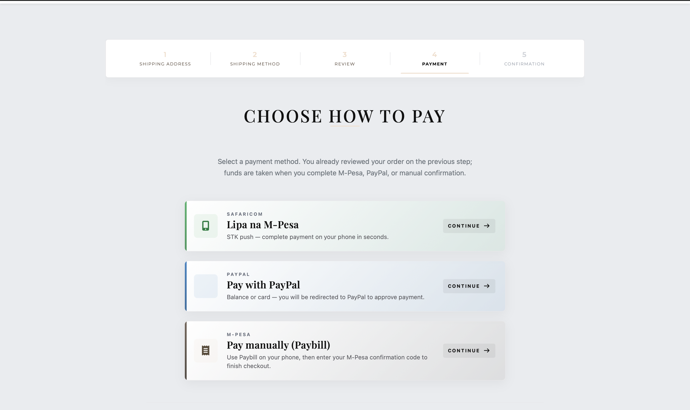

### 6. Order Confirmation
Instant verification and transparency upon successful transaction.
- 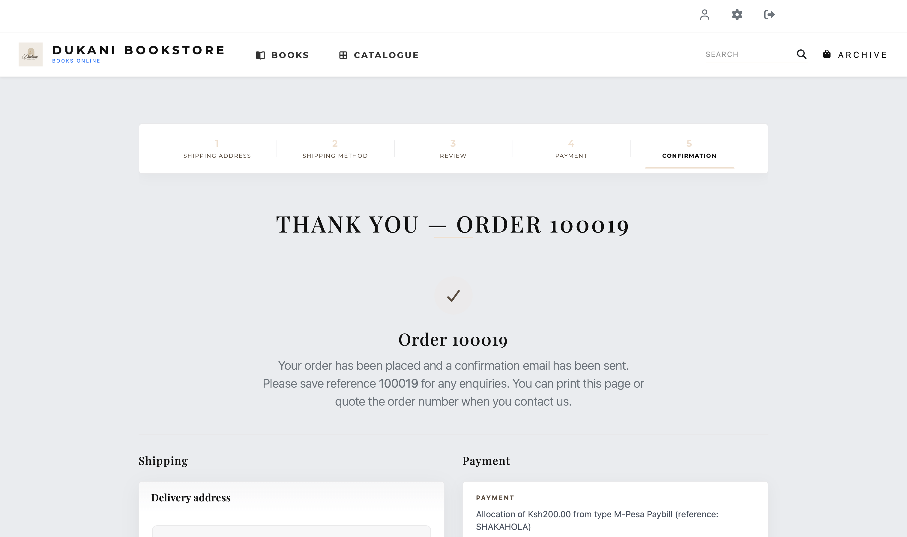

### 7. Client Account
Dedicated customer area for managing profiles and tracking order status.
- 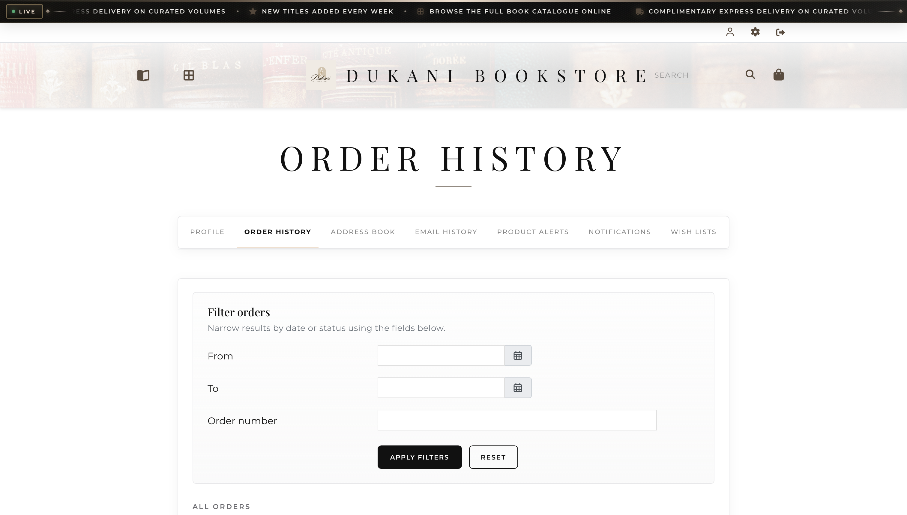

---

## Dashboard & Management

Dukani includes a sophisticated administrative interface for managing the
entire commerce operation.

### Operational Overview
Real-time summary of sales, recent orders, and store health.
- 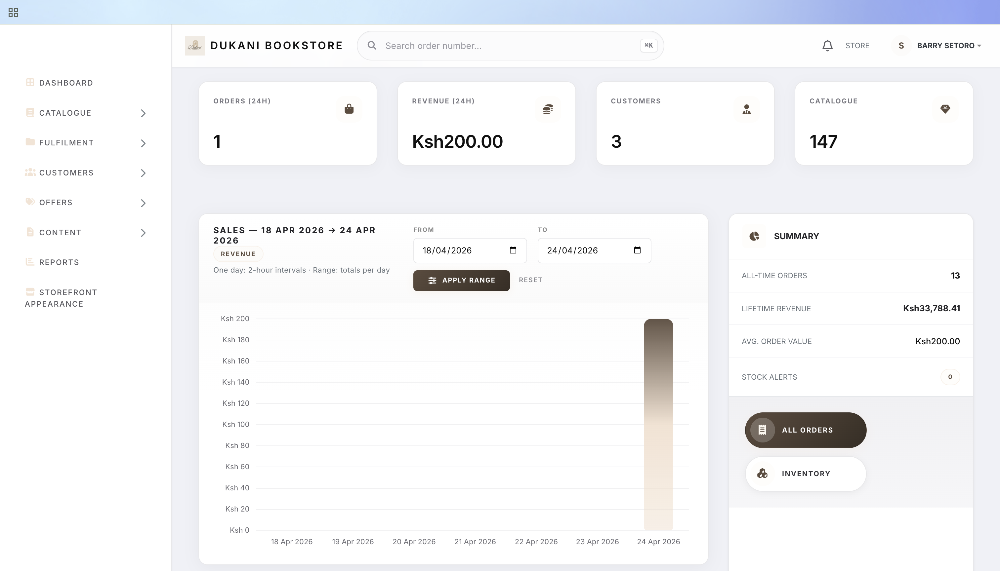

### Product Inventory
Intuitive management of the luxury product catalogue and stock levels.
- 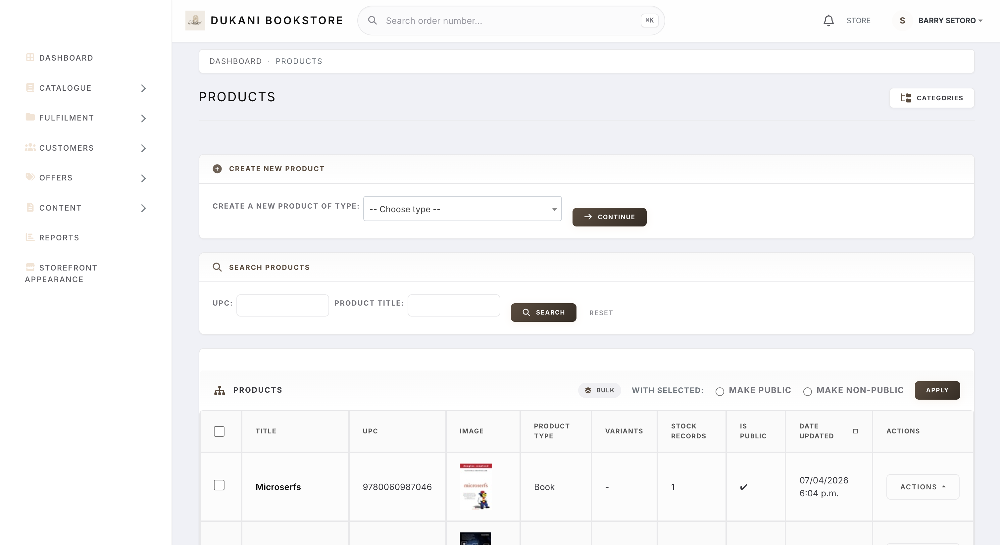

### Order Fulfillment
Streamlined pipeline for processing transactions and tracking shipments.
- 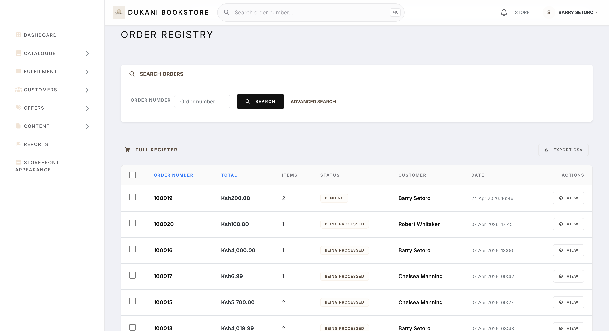

### Reporting & Analytics
Data-driven insights into store performance and customer trends.
- 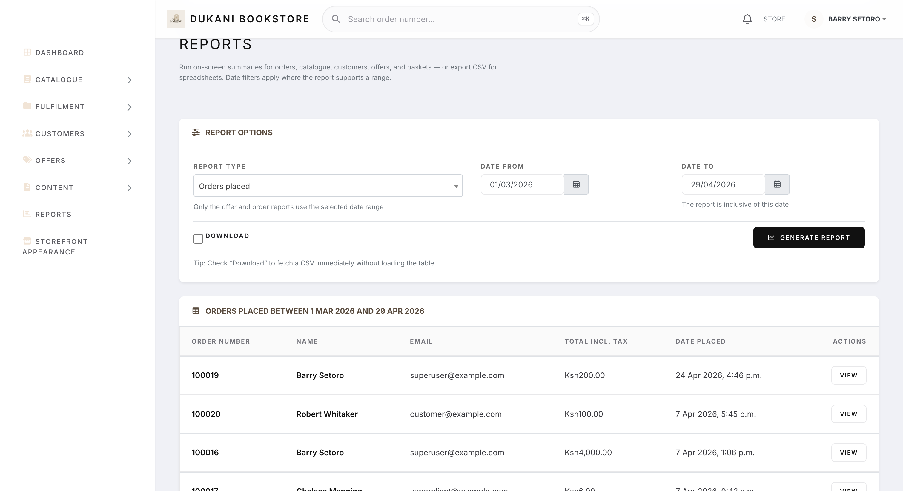

---

## Technical Core

- **Domain-driven commerce:** Built on Oscar's robust architecture for
  catalogue, basket, and checkout.
- **Luxury UI:** Bespoke templates styled with Bootstrap 4 and SCSS for
  a high-end feel.
- **Advanced search:** Integrated with Django Haystack for fast,
  relevant product discovery.
- **Scalable backend:** Powered by Django 4.2+ and Python 3.8+.

| Layer | Technology |
| --- | --- |
| **Backend** | Django, Python |
| **Store engine** | django-oscar (customized) |
| **Frontend** | Bootstrap 4, SCSS, jQuery |
| **Search** | Haystack (Whoosh/Solr/Elasticsearch) |

## Relationship to django-oscar

Dukani is a **fork** of
[django-oscar](https://github.com/django-oscar/django-oscar). The
vendored package lives in `src/oscar/` (same module name as upstream
for drop-in compatibility). The version in
[`src/oscar/__init__.py`](src/oscar/__init__.py) records the upstream
baseline this tree started from.

**Upgrade policy:** Treat django-oscar as the upstream of record. For
security and framework support, periodically merge or rebase upstream
releases into this fork, run the full test suite (`make test` / CI),
and resolve conflicts in customized templates and apps. Document
Dukani-only patches (in commit messages or small in-repo notes) so
future upgrades stay traceable.

**Linting:** CI and `make lint` run **Black** and **Pylint** on
`src/oscar/` and `tests/`. Optional
[pre-commit](https://pre-commit.com/) runs the same **Black** settings
(including skipping `migrations/`) plus lightweight YAML and large-file
checks. Install it with `pre-commit install` after
`pip install pre-commit`. Run `make lint` before pushing if you skip
pre-commit.

## Quick Start (Sandbox)

To get the development environment running:

```bash
# Setup environment
python -m venv venv
source venv/bin/activate

# Install and build sandbox
make sandbox
```

## Project Structure

- `src/oscar/`: The core commerce engine and customized templates.
- `sandbox/`: Local development settings and assets.
- `docs/screenshots/`: Visual assets for the storefront.

---

## License

Dukani is released under the **BSD License**. See [`LICENSE`](LICENSE)
for details.
