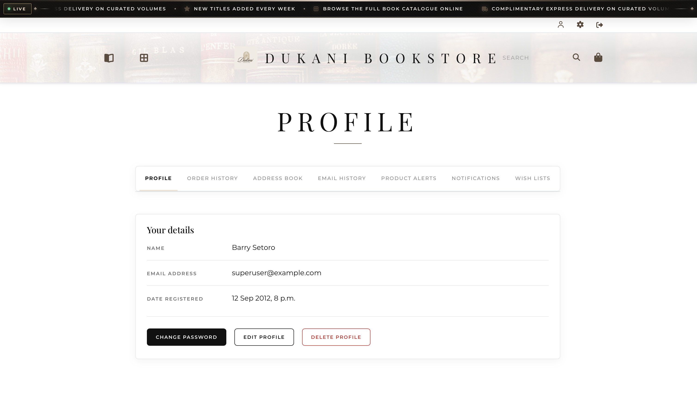
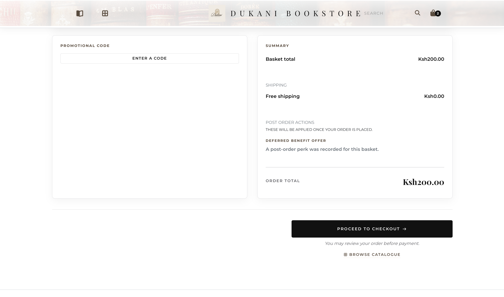
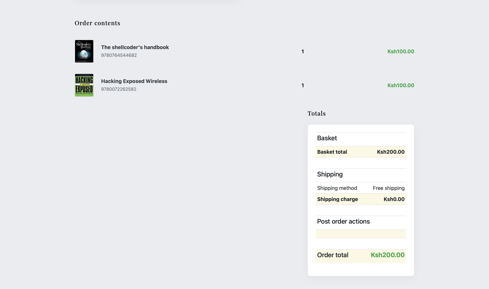
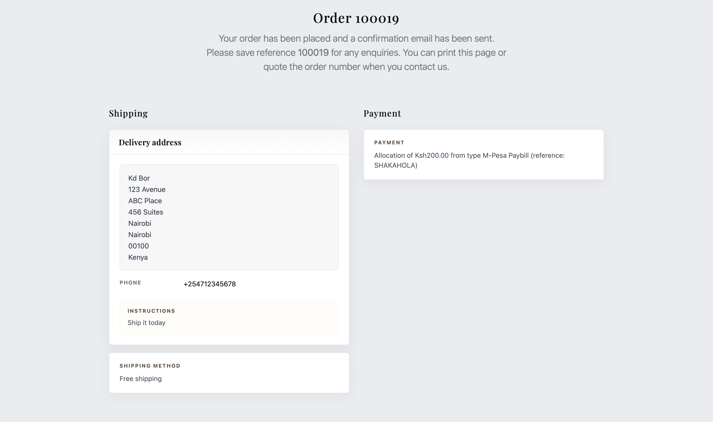
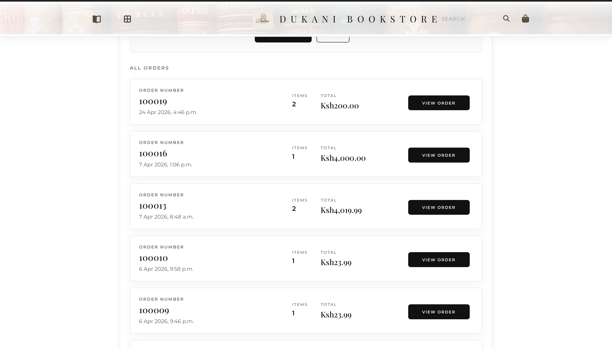
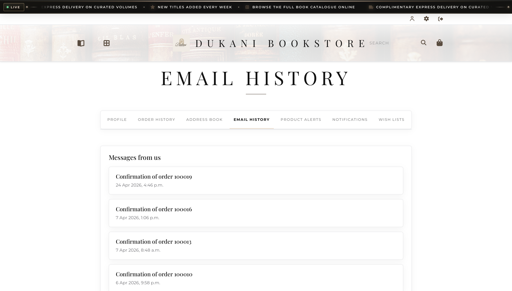
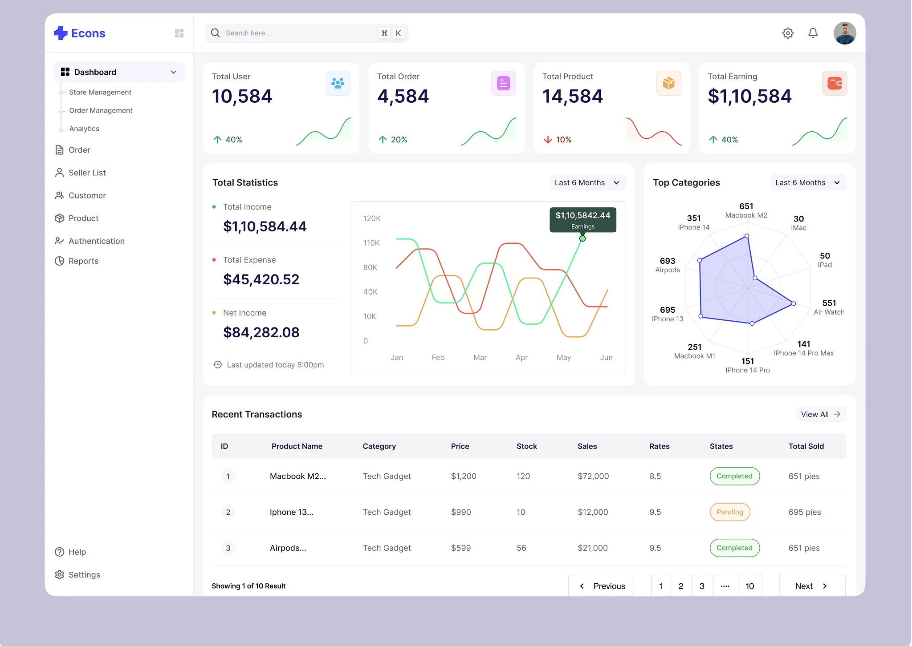
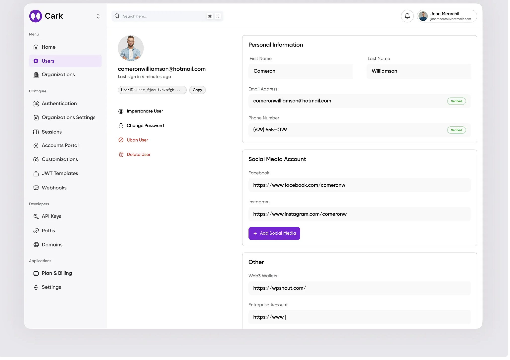
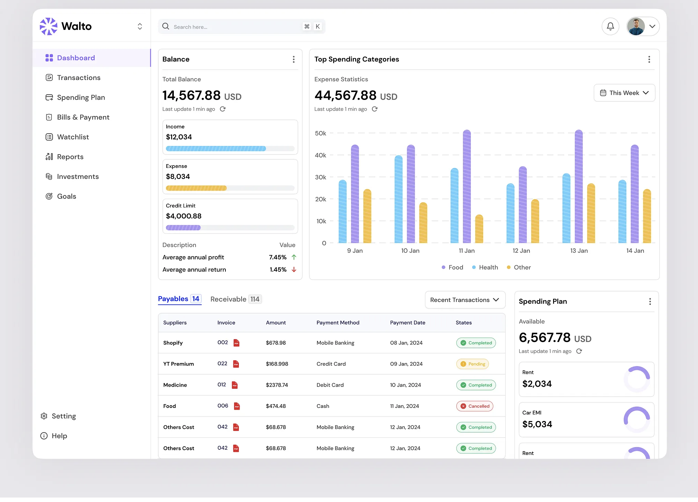

# Dukani

**Curated volumes & fine footwear** - A premium Django e-commerce
experience built on [Oscar](https://github.com/django-oscar/django-oscar).
Dukani features a luxury retail storefront, sophisticated catalogue
management, an intuitive basket system, and a multi-step checkout
pipeline.

---

## Experience the Storefront

### Homepage & Brand Experience

A premium landing page designed for high-end retail, featuring seamless
navigation and editorial merchandising.

- 
- 

### Catalogue & Merchandising

Browse curated categories with editorial grids optimized for luxury
retail.

- 

### Frictionless Shopping Bag

A modern, card-based shopping bag and a streamlined checkout flow.

- 
- 

### Secure Checkout Pipeline

A multi-step checkout process designed for high conversion and security.

- 
- 
- 

### Order Transparency & Account History

Comprehensive order tracking, receipt confirmation, and a dedicated
customer dashboard for order and communication history.

- 
- 
- 
- 
- 

---

## Dashboard & Management

Dukani includes a sophisticated administrative interface for managing the
entire commerce operation.

- 
- 
- 

---

## Technical Core

- **Domain-driven commerce:** Built on Oscar's robust architecture for
  catalogue, basket, and checkout.
- **Luxury UI:** Bespoke templates styled with Bootstrap 4 and SCSS for
  a high-end feel.
- **Advanced search:** Integrated with Django Haystack for fast,
  relevant product discovery.
- **Scalable backend:** Powered by Django 4.2+ and Python 3.8+.

| Layer | Technology |
| --- | --- |
| **Backend** | Django, Python |
| **Store engine** | django-oscar (customized) |
| **Frontend** | Bootstrap 4, SCSS, jQuery |
| **Search** | Haystack (Whoosh/Solr/Elasticsearch) |

## Relationship to django-oscar

Dukani is a **fork** of
[django-oscar](https://github.com/django-oscar/django-oscar). The
vendored package lives in `src/oscar/` (same module name as upstream
for drop-in compatibility). The version in
[`src/oscar/__init__.py`](src/oscar/__init__.py) records the upstream
baseline this tree started from.

**Upgrade policy:** Treat django-oscar as the upstream of record. For
security and framework support, periodically merge or rebase upstream
releases into this fork, run the full test suite (`make test` / CI),
and resolve conflicts in customized templates and apps. Document
Dukani-only patches (in commit messages or small in-repo notes) so
future upgrades stay traceable.

**Linting:** CI and `make lint` run **Black** and **Pylint** on
`src/oscar/` and `tests/`. Optional
[pre-commit](https://pre-commit.com/) runs the same **Black** settings
(including skipping `migrations/`) plus lightweight YAML and large-file
checks. Install it with `pre-commit install` after
`pip install pre-commit`. Run `make lint` before pushing if you skip
pre-commit.

## Quick Start (Sandbox)

To get the development environment running:

```bash
# Setup environment
python -m venv venv
source venv/bin/activate

# Install and build sandbox
make sandbox
```

## Project Structure

- `src/oscar/`: The core commerce engine and customized templates.
- `sandbox/`: Local development settings and assets.
- `docs/screenshots/`: Visual assets for the storefront.

---

## License

Dukani is released under the **BSD License**. See [`LICENSE`](LICENSE)
for details.
